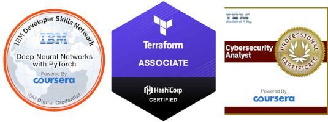

**BSc Hons Rdg MRi MIET MIEEE MBCS MCybS MIAP**

***

I am a technologist who speaks plain English. I sometimes play the Bagpipes too!

# Key Skills

I engage with stakeholders at every level to ensure that operational
objectives are achieved. Having worked with a wide variety of clients in an
equally wide variety of sectors for over a decade, my breadth of experience helps me to bring teams together and solve key challenges.

### Unique Value Proposition

Qualifications are all well and good, but how does that help you?

**Process Automation**

I allow your team to focus on duties that are best suited for people.

**Data Culture**

I help your team to obtain a *data first* and *DevOps* mindset, so that they can better understand and improve success
metrics.

**Training**

I upskill your team so that they have the skills and mindset required for a data driven environment.

***In short, I automate the boring stuff so that your people can better add value.***

### Nitty Gritty

Want some more details? My key technical skills include;

#### Software Development

  - Python
  - AWS
  - Terraform
  - CI/CD; CircleCI, GitHub Actions, Concourse
  - SQL; MySql, PostgreSQL, Microsoft SQL Server
  - Raspberry Pi

#### Linux

  - Operating system & third party software, admin, installation, version upgrades, patches, performance analysis and
    optimisation.
  - Debian, Ubuntu, RHEL
  - RDBMS, internet services (such as web, SMTP, FTP), firewall, game (such as Minecraft), Virtualisation,
    Containerisation, Enterprise backup. LAMP.
  - Grafana

#### Windows

  - Server; Firewall, AD & Exchange, configuration & management.
  - Client, Xp to 10; install, configuration, troubleshooting.

#### Networking

  - Managed Switches, Routers, WiFi Planning & Deployment, Cabling.
  - Unifi, HP, Netgear, Draytek, Zyxel, Draytek, Cisco, Netgear.
  - EPoS; Zonal, Micros, Verifone.
  - TCP, IP, SNMP, DNS, SMTP, NTP, DHCP.

# Interests
## Geek.Zone

I founded [Geek.Zone](http://Geek.Zone) in 2013 with the aim of connecting geeky people. Some still erroneously think
that “geek” is a pejorative term, and why should it be? After all, a geek is someone who is knowledgeable, passionate
and interested. Are these not positive qualities? Are these not the characteristics that are needed in order to improve
society and the planet?

Since 2013, Geek.Zone has

- grown to three Districts around Britain.
- touched the lives of thousands of people.
- been recognised with UK registered charity status.

Our next step is to open [Geek.Zone/01](http://geek.zone/01) in Coventry, our first 24/7 community hub.
[Support us now](https://link.justgiving.com/v1/campaign/donate/campaignGuid/f245c00d-ce79-4fa4-959f-c266cdb6a3ba?currency=GBP&amount=50)!
##Motoring
Aside from technology, my interests are rather varied. They include classic motoring, ranging from my beautiful 1982
Mini HLE, up to the Routemaster, which I have had the good fortune to have a go at driving!

##Bagpipes
I also play the Great Highland Bagpipes. I do understand that this is quite a “Marmite” instrument, however they have
taken me on some great adventures, such as folk festivals across Europe and hundred-piper massed bands.

##Aviation
One of my earliest passions is certainly aviation. The mechanics and engineering that goes into every square centimetre
of an aircraft design is simply stunning. I am certainly looking forward to attaining my Private Pilots Licence!

# Gifts

If you feel like doing something awesome for me for any reason, I would be very grateful of a gift via any of these
great places!

- [Ko-fi](https://ko-fi.com/jamesgeddes)
- [Amazon](https://www.amazon.co.uk/hz/wishlist/ls/WS5TGJQ9K8BS?ref_=wl_share)
- [Steam](https://store.steampowered.com/wishlist/id/jamesgeddes#sort=reviewscore)
- [PayPal](https://www.paypal.me/jamesgeddes)

Please [Dont Send Me A Card](https://www.dontsendmeacard.com/charities/6Iws)! Physical greetings cards go in the bin
within a few days, so sending an ecard via [Dont Send Me A Card](https://www.dontsendmeacard.com/charities/6Iws) instead
allows you to support my favourite charity, Geek.Zone.

# Contact

The best way to contact me is to [select a time](https://jamesgeddes.pro/meeting) for us to talk.

- [Phone](https://jamesgeddes.pro/meeting)
- [Email](mailto:j@jamesgeddes.pro)
- [LinkedIn](https://www.linkedin.com/in/jamesgeddes/)
- [Twitter](https://twitter.com/JamesGeddes)
- [Facebook](https://facebook.com/JamesGeddes)
- [GitHub](https://github.com/jamesgeddes)
- [Wikipedia](https://en.wikipedia.org/wiki/User:JamesGeddes)
- [GPG key](http://jamesgeddes.pro/gpg/jamesgeddes.txt)
